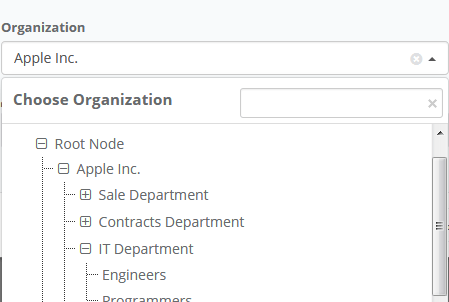

# Tree Dropdown

English:

Dropdown with tree.
This is extension for Yii2 framework. 

Russian:

Выпадающий список с деревом. Расширение для фреймворка Yii2.

## Sreenshots / Скриншоты

English:

 


Russian:

 


## Installation / Установка

English:

The preferred way to install this extension is through [composer](http://getcomposer.org/download/).

Either run

```
$ php composer.phar require delikates-nsk/yii2-shadowed-tabs "@dev"
```

or add

```
"delikates-nsk/yii2-shadowed-tabs": "@dev"
```

to the ```require``` section of your `composer.json` file and run

```
$ php composer.phar update
```

Russian:

Быстрее всего установить расширение можно с помощью [composer](http://getcomposer.org/download/).

Выполните следующую команду

```
$ php composer.phar require delikates-nsk/yii2-tree-dropdown "@dev"
```

или добавьте строчку

```
"delikates-nsk/yii2-yii2-tree-dropdown": "@dev"
```

в раздел ```require``` в файле `composer.json` вашего проекта и выполните следующую команду

```
$ php composer.phar update
```

## Usage / Использование

English:

```php
<?php
    echo \delikatesnsk\treedropdown\DropdownTreeWidget::widget([
        'id' => 'organizationsList', //<-- id of dropdown container (ATTENTION! Required if you have more than one DropdownTreeWidget at page!)
        'form' => $form, // <-- ActiveForm (for generate hidden input)
        'model' => $model, // <-- Model  (for generate hidden input)
        'attribute' => 'org_id', //<-- Model attribute  (for generate hidden input)
        'label' => \Yii::t('app', 'Organization'), //Label of dropdown
        'multiSelect' => true, //multiple select dropdown items (true, false, 'auto')
        'searchPanel' => [
                             'visible' => true, //show or hide search panel
                             'label' => \Yii::t('app', 'Choose Organization'), //title for search panel
                             'placeholder' => '',  //search input placeholder text
                             'searchCaseSensivity' => false //searching text inside dropdown 
                                                            //with caseSensivity or No
                         ], 
        'rootNode' => [
                          'visible' => true, //show tree root node or not 
                          'label' => \Yii::t('app', 'Root Node') //label for root node
                      ],
        'expand' => false, //expand dropdown tree after show
        'items' => [
                        [
                            'id' => 1,
                            'label' => '<i class="fa fa-star"></i> Apple Inc.',
                            'items' => [
                                           [
                                               'id' => 2,
                                               'label' => 'Sale Department',
                                               'items' => [
                                                              [
                                                                  'id' => 3,
                                                                  'label' => 'Supervisors'
                                                              ],
                                                              [
                                                                  'id' => 4,
                                                                  'label' => 'Managers'
                                                              ],
                                                              [
                                                                  'id' => 5,
                                                                  'label' => 'Assistants'
                                                              ],
                                                          ]
                                           ],
                                           [
                                               'id' => 6,
                                               'label' => 'Contracts Department',
                                               'items' => [
                                                              [
                                                                  'id' => 7,
                                                                  'label' => 'Coordinators'
                                                              ],
                                                              [
                                                                  'id' => 8,
                                                                  'label' => 'Managers'
                                                              ],
                                                              [
                                                                  'id' => 9,
                                                                  'label' => 'Clerks'
                                                              ],
                                                          ]
                                           ],
                                           [
                                               'id' => 10,
                                               'label' => 'IT Department',
                                               'items' => [
                                                              [
                                                                  'id' => 11,
                                                                  'label' => 'Engineers'
                                                              ],
                                                              [
                                                                  'id' => 12,
                                                                  'label' => 'Programmers'
                                                              ],
                                                          ]
                                           ]

                                       ]
                        ],
                   ]
    ]);
?>
```
Russian:

```php
<?php
    echo \delikatesnsk\treedropdown\DropdownTreeWidget::widget([
        'id' => 'organizationsList', //<-- id контейнера выпадающего списка (ВНИМАНИЕ! Обязателен, если на странице несколько DropdownTreeWidget)
        'form' => $form, // <-- ActiveForm (форма, для генерации скрытого input который будет отправлен в контроллер после submit формы)
        'model' => $model, // <-- Model  (модель, для генерации скрытого input в который и будут подставляться выбранные значения)
        'attribute' => 'org_id', //<-- Model attribute  (атрибут модели, для генерации скрытого input)
        'label' => \Yii::t('app', 'Organization'), //Заголовок выпадающего списка
        'multiSelect' => true, //Если true, то из списка можно будет выбрать более одного значения
        'searchPanel' => [
                             'visible' => true, //Если true, то будет отображена панели с полем для поиска по дереву
                             'label' => \Yii::t('app', 'Choose Organization'), //Заголовок для панели
                             'placeholder' => '',  //Текст-подсказка внутри поля для поиска
                             'searchCaseSensivity' => false //Если True, то поиск по дереву будет регистрозависимый
                         ], 
        'rootNode' => [
                          'visible' => true, //Отображать корневой узел или нет
                          'label' => \Yii::t('app', 'Root Node') //Название корневого узла
                      ],
        'expand' => false, //Распахнуть выпадающий список сразу после отображения
        //Список узлов дерева с под-узлами
        'items' => [
                        [
                            'id' => 1, //ID узла, который будет подставлен в скрытый input при выборе данного узла
                            'label' => '<i class="fa fa-star"></i> Apple Inc.', //название узла, внутри можно использовать html-теги
                            //список дочерних узлов (заполняется аналогично родительскому, обратите внимание, что это массив массивов!)
                            'items' => [
                                           [
                                               'id' => 2,
                                               'label' => 'Sale Department',
                                               'items' => [
                                                              [
                                                                  'id' => 3,
                                                                  'label' => 'Supervisors'
                                                              ],
                                                              [
                                                                  'id' => 4,
                                                                  'label' => 'Managers'
                                                              ],
                                                              [
                                                                  'id' => 5,
                                                                  'label' => 'Assistants'
                                                              ],
                                                          ]
                                           ],
                                           [
                                               'id' => 6,
                                               'label' => 'Contracts Department',
                                               'items' => [
                                                              [
                                                                  'id' => 7,
                                                                  'label' => 'Coordinators'
                                                              ],
                                                              [
                                                                  'id' => 8,
                                                                  'label' => 'Managers'
                                                              ],
                                                              [
                                                                  'id' => 9,
                                                                  'label' => 'Clerks'
                                                              ],
                                                          ]
                                           ],
                                           [
                                               'id' => 10,
                                               'label' => 'IT Department',
                                               'items' => [
                                                              [
                                                                  'id' => 11,
                                                                  'label' => 'Engineers'
                                                              ],
                                                              [
                                                                  'id' => 12,
                                                                  'label' => 'Programmers'
                                                              ],
                                                          ]
                                           ]

                                       ]
                        ],
                   ]
    ]);
?>
```

##  Loading of child nodes through Ajax / Загрузка дочерних узлов с помощью Ajax

English:

```php
<?php
    echo \delikatesnsk\treedropdown\DropdownTreeWidget::widget([
        'id' => 'organizationsList', 
        'form' => $form, 
        'model' => $model,
        'attribute' => 'org_id',
        'label' => \Yii::t('app', 'Organization'),
        'multiSelect' => true,
        'searchPanel' => [
                             'visible' => true,
                             'label' => \Yii::t('app', 'Choose Organization'),
                             'placeholder' => '',
                             'searchCaseSensivity' => false
                         ], 
        'rootNode' => [
                          'visible' => true,
                          'label' => \Yii::t('app', 'Root Node')
                      ],
        'expand' => false,
        'items' => [],
        'ajax' => [
                      //when node expand event triggered, you can send ajax request with specified params, 
                      //returned data must be json_encoded array as `items` at previous sample
                      'onNodeExpand' => [
                                            'url' => '/getchilds/', //URL for ajax request when node expanded
                                            'method' => 'post', //post or get, default post
                                            'params' => [
                                                            'param1' => 'value1',  // <-- Your additional params (if you need)
                                                            'param2' => 'value1',
                                                            'param3' => 'value1',
                                                            'node_id' => '%nodeId' // <-- %nodeId replaced to id of expanded node, 
                                                                                   // you can change 'node_id' key to any other, default key is 'id'
                                                        ]
                                        ],
                      //when node collapse event triggered, you can send ajax request with specified params, 
                      //returned data  will not be processed
                      'onNodeCollapse' => [
                                              'url' => '/setchilds/', //URL for ajax request
                                              'method' => 'get', //post or get
                                              'params' => [
                                                              'param1' => 'value1',  // <-- Your additional params (if you need)
                                                              'collapsed_node_id' => '%nodeId' // <-- %nodeId replaced to id of collapsed node, 
                                                                                               // you can change 'collapsed_node_id' key to any other, default key is 'id'
                                                          ]
                                          ]
                  ],

    ]);
?>

...

Controller

public function actionGetchilds() {
    $node_id = \Yii::$app->request->post('node_id');
    if ( !is_numeric( $node_id ) ) {
        $model =  OrganizationsTableModel::find()
                       ->andWhere(['is', 'parent_id', NULL])
                       ->orderBy(['parent_id' => SORT_ASC, 'name' => SORT_ASC])->all();
    } else {
        $model =  OrganizationsTableModel::find()
                       ->where(['parent_id' => $node_id ])
                       ->orderBy(['parent_id' => SORT_ASC, 'name' => SORT_ASC])->all();
    }
    $childsList = [];
    if ( $model !== null && is_array( $model ) && count( $model ) > 0 ) {
        foreach( $model as $item ) {
            $childsList[] = [ 'id' => $item->id, 'label' => $item->name, 'items' => [] ];
            //You can run an additional query here 
            //to see if the node has children or not. 
            //Depending on this, you can set or not set parameter 'items'
        }
    }
    return json_encode( $childsList );
}

public function actionSetchilds($collapsed_node_id) {
    //... Your some code here
    return json_encode( [ 'id' => $collapsed_node_id ] );
}

```
Russian:

```php
<?php
    echo \delikatesnsk\treedropdown\DropdownTreeWidget::widget([
        'id' => 'organizationsList', 
        'form' => $form, 
        'model' => $model,
        'attribute' => 'org_id',
        'label' => \Yii::t('app', 'Organization'),
        'multiSelect' => true,
        'searchPanel' => [
                             'visible' => true,
                             'label' => \Yii::t('app', 'Choose Organization'),
                             'placeholder' => '',
                             'searchCaseSensivity' => false
                         ], 
        'rootNode' => [
                          'visible' => true,
                          'label' => \Yii::t('app', 'Root Node')
                      ],
        'expand' => false,
        'items' => [],
        'ajax' => [
                      //в момент когда узел распахнется будет отправлен ajax-запрос с указанными ниже параметрами
                      //обратите внимание, возвращаемые данные должны быть в формате json как параметр `items` из примера выше
                      'onNodeExpand' => [
                                            'url' => '/getchilds/', //Тут укажите URL куда будет отправлен ajax-запрос
                                            'method' => 'post', //Метод (POST или GET), по-умолчанию POST
                                            //отправляемые параметры
                                            'params' => [
                                                            'param1' => 'value1',  // <-- Ваши дополнительные параметры (если нужно)
                                                            'param2' => 'value1',
                                                            'param3' => 'value1',
                                                            'node_id' => '%nodeId' // <-- алиас %nodeId будет заменен на ID узла
                                                                                   // вы можете изменить ключ 'node_id' на любой другой, по-умолчанию ключ всегда 'id'
                                                        ]
                                        ],
                      //в момент когда узел свернется будет отправлен ajax-запрос с указанными ниже параметрами
                      //обратите внимание, возвращаемые данные никак не обрабатываются, по сути это отправка данных в одну сторону
                      'onNodeCollapse' => [
                                              'url' => '/setchilds/', //Тут укажите URL куда будет отправлен ajax-запрос
                                              'method' => 'get', //Метод (POST или GET), по-умолчанию POST
                                              'params' => [
                                                              'param1' => 'value1',  // // <-- Ваши дополнительные параметры (если нужно)
                                                              'collapsed_node_id' => '%nodeId' // <-- алиас %nodeId будет заменен на ID узла
                                                                                               // вы можете изменить ключ 'node_id' на любой другой, по-умолчанию ключ всегда 'id'
                                                          ]
                                          ]
                  ],

    ]);
?>

...

Пример обработки в контроллере

//Обработка события `распахивания` узла
public function actionGetchilds() {
    $node_id = \Yii::$app->request->post('node_id');
    if ( !is_numeric( $node_id ) ) {
        $model =  OrganizationsTableModel::find()
                       ->andWhere(['is', 'parent_id', NULL])
                       ->orderBy(['parent_id' => SORT_ASC, 'name' => SORT_ASC])->all();
    } else {
        $model =  OrganizationsTableModel::find()
                       ->where(['parent_id' => $node_id ])
                       ->orderBy(['parent_id' => SORT_ASC, 'name' => SORT_ASC])->all();
    }
    $childsList = [];
    if ( $model !== null && is_array( $model ) && count( $model ) > 0 ) {
        foreach( $model as $item ) {
            $childsList[] = [ 'id' => $item->id, 'label' => $item->name, 'items' => [] ];
            //Тут можно выполнить доп. запрос к БД и узнать если ли у узла дети
            //И если есть, вернуть параметр `items`, иначе его не возвращать
            //Тогда при построении дерева, у узла либо будет выведена иконка `распахнуть`, либо нет
            //Но все зависит от Вашей реализации древовидной структуры таблиц к которой вы обращаетесь
        }
    }
    return json_encode( $childsList );
}

//Обработка события `сворачивания` узла
public function actionSetchilds($collapsed_node_id) {
    //... Какой-от Ваш код здесь
}

```

