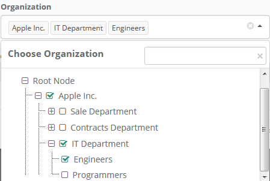

# Tree Dropdown

English:

Dropdown with tree.
This is extension for Yii2 framework. 

Russian:

Выпадающий список с деревом. Расширение для фреймворка Yii2.

## Sreenshots

English:

 


Russian:

 


## Usage

```php
<?php
    echo \delikatesnsk\treedropdown\DropdownTreeWidget::widget([
        'id' => 'organizationsList', //<-- id of dropdown container
        'form' => $form, // <-- ActiveForm (for generate hidden input)
        'model' => $model, // <-- Model  (for generate hidden input)
        'attribute' => 'org_id', //<-- Model attribute  (for generate hidden input)
        'label' => \Yii::t('app', 'Organization'), //Label of dropdown
        'multiSelect' => true, //multiple select dropdown items (true, false, 'auto')
        'searchPanel' => [
                             'visible' => true, //show or hide search panel
                             'label' => \Yii::t('app', 'Choose Organization'), //title for search panel
                             'placeholder' => '',  //search input placeholder text
                             'searchCaseSensivity' => false //searching text inside dropdown with caseSensivity or No
                         ], 
        'rootNode' => [
                          'visible' => true, //show tree root node or not 
                          'label' => \Yii::t('app', 'Root Node') //label for root node
                      ],
        'expand' => false, //expand dropdown tree after show
        'items' => [
                        [
                            'id' => 1,
                            'label' => '<i class="fa fa-star"></i> Apple Inc.',
                            'items' => [
                                           [
                                               'id' => 2,
                                               'label' => 'Sale Department',
                                               'items' => [
                                                              [
                                                                  'id' => 3,
                                                                  'label' => 'Supervisors'
                                                              ],
                                                              [
                                                                  'id' => 4,
                                                                  'label' => 'Managers'
                                                              ],
                                                              [
                                                                  'id' => 5,
                                                                  'label' => 'Assistants'
                                                              ],
                                                          ]
                                           ],
                                           [
                                               'id' => 6,
                                               'label' => 'Contracts Department',
                                               'items' => [
                                                              [
                                                                  'id' => 7,
                                                                  'label' => 'Coordinators'
                                                              ],
                                                              [
                                                                  'id' => 8,
                                                                  'label' => 'Managers'
                                                              ],
                                                              [
                                                                  'id' => 9,
                                                                  'label' => 'Clerks'
                                                              ],
                                                          ]
                                           ],
                                           [
                                               'id' => 10,
                                               'label' => 'IT Department',
                                               'items' => [
                                                              [
                                                                  'id' => 11,
                                                                  'label' => 'Engineers'
                                                              ],
                                                              [
                                                                  'id' => 12,
                                                                  'label' => 'Programmers'
                                                              ],
                                                          ]
                                           ]

                                       ]
                        ],
                   ]
    ]);
?>
```
##  Loading of child nodes through Ajax

```php
<?php
    echo \delikatesnsk\treedropdown\DropdownTreeWidget::widget([
        'id' => 'organizationsList', //<-- id of dropdown container
        'form' => $form, // <-- ActiveForm (for generate hidden input)
        'model' => $model, // <-- Model  (for generate hidden input)
        'attribute' => 'org_id', //<-- Model attribute  (for generate hidden input)
        'label' => \Yii::t('app', 'Organization'), //Label of dropdown
        'multiSelect' => true, //multiple select dropdown items (true, false, 'auto')
        'searchPanel' => [
                             'visible' => true, //show or hide search panel
                             'label' => \Yii::t('app', 'Choose Organization'), //title for search panel
                             'placeholder' => '',  //search input placeholder text
                             'searchCaseSensivity' => false //searching text inside dropdown with caseSensivity or No
                         ], 
        'rootNode' => [
                          'visible' => true, //show tree root node or not 
                          'label' => \Yii::t('app', 'Root Node') //label for root node
                      ],
        'expand' => false, //expand dropdown tree after show
        'items' => [],
        'ajax' => [
                      //when node expand event triggered, you can send ajax request with specified params, returned data must be json_encoded array as `items` at previous sample
                      'onNodeExpand' => [
                                            'url' => '/getchilds/', //URL for ajax request when node expanded
                                            'method' => 'post', //post or get, default post
                                            'params' => [
                                                            'param1' => 'value1',  // <-- Your additional params (if you need)
                                                            'param2' => 'value1',
                                                            'param3' => 'value1',
                                                            'node_id' => '%nodeId' // <-- %nodeId replaced to id of expanded node, you can change 'node_id' key to any other, default key is 'id'
                                                        ]
                                        ],
                      //when node collapse event triggered, you can send ajax request with specified params, returned data  will not be processed
                      'onNodeCollapse' => [
                                              'url' => '/setchilds/', //URL for ajax request
                                              'method' => 'get', //post or get
                                              'params' => [
                                                              'param1' => 'value1',  // <-- Your additional params (if you need)
                                                              'collapsed_node_id' => '%nodeId' // <-- %nodeId replaced to id of collapsed node, you can change 'collapsed_node_id' key to any other, default key is 'id'
                                                          ]
                                          ]
                  ],

    ]);
?>

...

Controller

public function actionGetchilds() {
    $node_id = \Yii::$app->request->post('node_id');
    if ( !is_numeric( $node_id ) ) {
        $model =  OrganizationsTableModel::find()
                       ->andWhere(['is', 'parent_id', NULL])
                       ->orderBy(['parent_id' => SORT_ASC, 'name' => SORT_ASC])->all();
    } else {
        $model =  OrganizationsTableModel::find()
                       ->where(['parent_id' => $node_id ])
                       ->orderBy(['parent_id' => SORT_ASC, 'name' => SORT_ASC])->all();
    }
    $childsList = [];
    if ( $model !== null && is_array( $model ) && count( $model ) > 0 ) {
        foreach( $model as $item ) {
            $childsList[] = [ 'id' => $item->id, 'label' => $item->name, 'items' => [] ];
        }
    }
    return json_encode( $childsList );
}

public function actionSetchilds($collapsed_node_id) {
    //... Your some code here
    return json_encode( [ 'id' => $collapsed_node_id ] );
}

```
